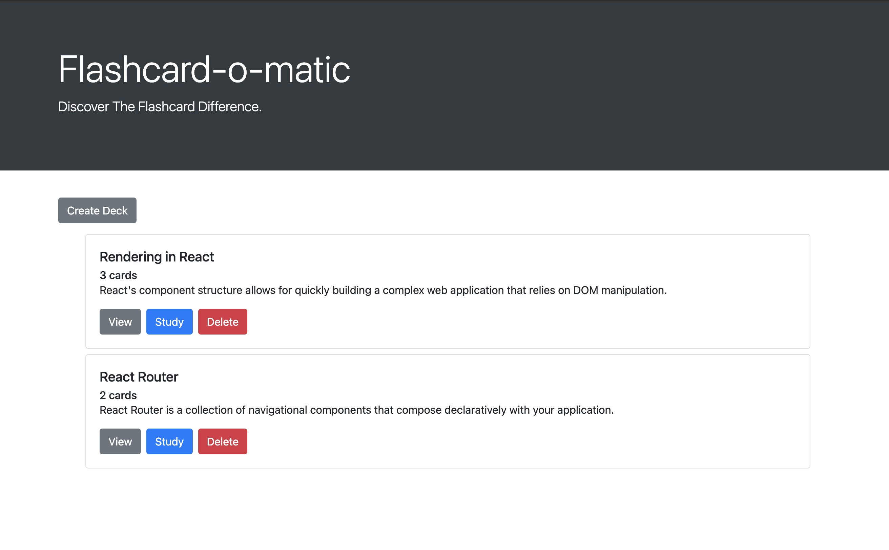

# Flashcard-o-matic

Created a flashcard application that allows users to create, edit, and delete decks and cards for studying purposes.

## Technology

JavaScript, React, HTML, CSS, and Bootstrap. 

## Installation

1. Fork and clone this repository.
1. Run `npm install` to install project dependencies.
1. Run `npm start`.

## Project Reflection

This project was created as an assignment for my studies in Thinkful's Software Engineering Certification program. 

Project goals and learnings included: 
- Installing packages via NPM
- Running tests from the command line
- Writing React function components
- Creating routes, including nested routes, using React Router
- Using hooks like useState(), useParams(), and useHistory()
- Debugging React code through console output and using the VS Code debugger

